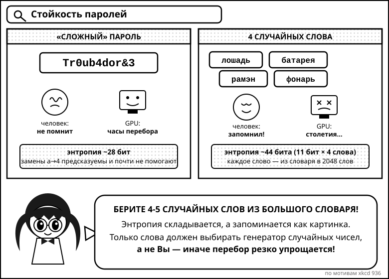
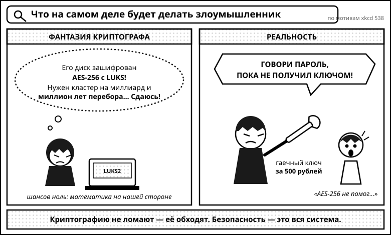
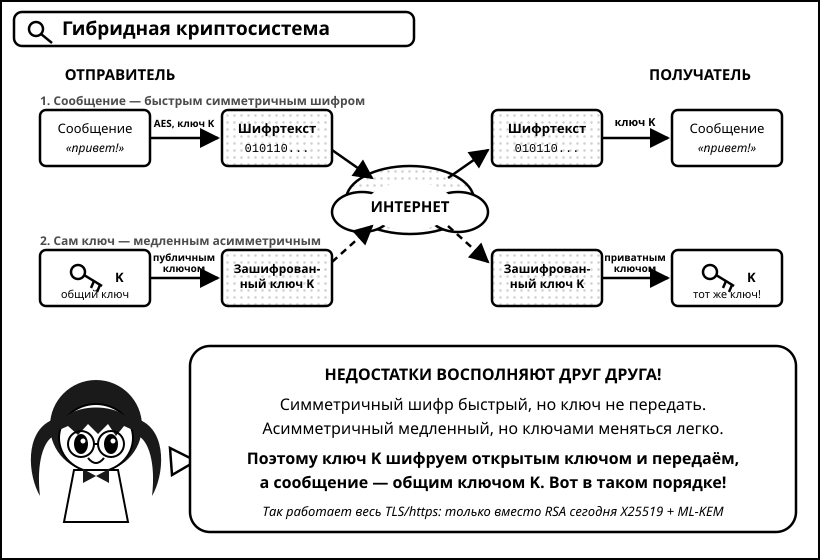
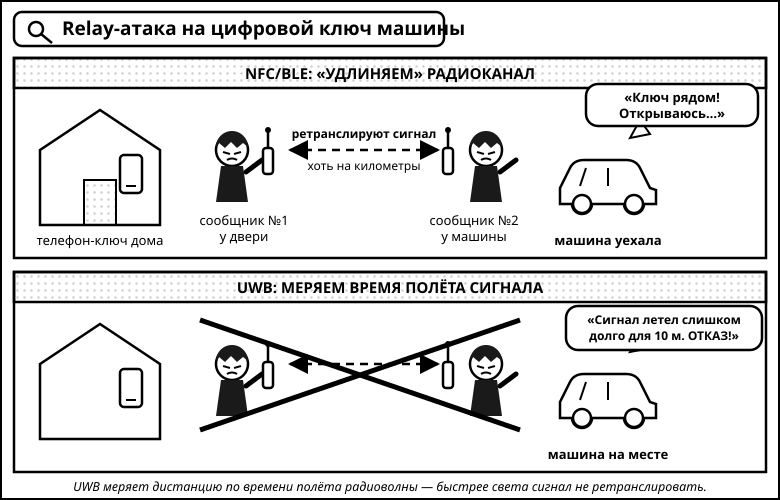

# Безопасность и приватность

## Безопасность

Это всегда вопрос про доверие, и технологии лишь позволяют Вам проверить, что
некоторые свойства безопасности гарантируются. Уровень доверия снижается где-то
в последовательности "я, семья, партнер, предмет быта, телефон, прохожий, сеть, убийца."
Как самый банальный пример: к Вам может ворваться грабитель и взломать Ваш замок.
Почему так не происходит часто? Если убрать социальные причины, одна из
причин &mdash; замки взламывать становится сложнее из-за сложности конструкций,
или непрактично подделывать ключи, люди могут заметить взломщиков.

С безопасностью в интернете примерно так же, только теперь мы пытаемся сделать
так, чтобы другие компьютеры нас не смогли взломать (а точнее их мощностей не
хватит). Из хороших новостей, с которыми Вы скорее всего как-то сталкивались
на алгоритмах:

* Нам сложно решать NP-полные задачи
* Как числовой пример, нам сложно факторизовать числа
* Нам сложно перебирать

Это лишь говорит о том, что если кто-то научится решать проблему из
вышеперечисленных эффективно, они получат намного больше, чем взлом Вашего
пароля в ВКонтакте. Банковская, ядерная система рухнет и в целом можно
начать апокалипсис, если кто-то решит любую из трёх задач выше.

Важная оговорка 2026 года: квантовые компьютеры теоретически умеют
факторизовать числа (алгоритм Шора), и хотя практических машин нужного размера
ещё нет, индустрия уже мигрирует на постквантовую криптографию &mdash; об этом
ниже в разделе про шифрование.

## Пароли

Если рассматривать односторонние пароли, то самое важное понятие, которым
надо руководствоваться &mdash; сколько злоумышленнику потребуется времени, чтобы
его перебрать. Математическое понятие &mdash; энтропия. Фактически,
логарифм количества вариантов. На этот счёт есть хороший комикс:



(по мотивам [xkcd 936](https://xkcd.com/936/))

Почти любой может перебрать пароли с энтропией 25-30. Это всего какие-то жалкие
миллиарды операций. Цифры с годами становятся только хуже для нас: одна
видеокарта NVIDIA RTX 5090 перебирает ~340 миллиардов NTLM-хэшей в секунду,
поэтому небольшая стойка из нескольких GPU спокойно делает **триллион** в
секунду. Возьмём триллион (10^12) как оценку злоумышленника с бюджетом в
несколько десятков тысяч долларов. Пароли из больших и маленьких букв + цифр,
алфавит 62 символа:

* 6 символов. 0.06 секунд, энтропия 35
* 8 символов. 3.5 минуты, энтропия 47
* 9 символов. 4 часа, энтропия 53
* 10 символов. 10 дней, энтропия 59
* 11 символов. 1.5 **года**, энтропия 65
* 12 символов. ~100 **лет**, энтропия 71
* 13 символов. ~6000 **лет**, энтропия 77

Дальше экспоненциально, понятное дело. Поиграться можно
[здесь](https://www.grc.com/haystack.htm). Важный нюанс: эти скорости &mdash;
для "быстрых" хэшей (MD5, NTLM, SHA-1). Если сайт хранит пароли через
специальные медленные хэши (bcrypt, scrypt, Argon2 &mdash; см. раздел про
хэширование), скорость перебора падает на 5-7 порядков: тот же RTX 5090 делает
лишь сотни тысяч bcrypt-хэшей в секунду. Но Вы не знаете, как сайт хранит Ваш
пароль, поэтому считайте пессимистично.

Если не рассматривать квантовые компьютеры, перебор пароля с энтропией 70+
занимает огромное количество ресурсов и практически невозможен, если не
задействует десятки миллионов долларов для вычислений.

Главное, не повторяться и генерировать их случайно для тех сайтов, на которых
Вам не надо часто делать логин. Для этого существуют парольные менеджеры:
[KeePassXC](https://keepassxc.org/), [Bitwarden](https://bitwarden.com/),
[1Password](https://1password.com/). Поучительная история про доверие:
LastPass, который годами был рекомендацией по умолчанию, в 2022 году
[взломали](https://blog.lastpass.com/posts/notice-of-recent-security-incident)
и украли зашифрованные хранилища пользователей &mdash; у кого мастер-пароль был
слабым, у тех пароли потом расшифровали и, например, уводили криптокошельки.
Мораль: менеджер паролей не отменяет требований к мастер-паролю, и репутация
вендора имеет значение.

Вы можете спросить, не является ли это проблемой курицы и яйца? Является.
Сгенерируйте один пароль, который написан на бумажке для этих парольных
менеджеров. Если Вы его забудете, будет плохо, конечно, если у Вас его украдут,
тоже будет плохо (см. про доверие к себе), если украдут что угодно остальное,
то будет ещё неплохо. Например, даже если какой-то сайт взломали и все пароли
вытащили, Вы можете быть уверенными, что другие сайты не взломают с Вашим
логином.

Эту цепочку можно раскручивать очень далеко и можно стать параноиком, что за
Вами следят. Это уже Вам решать, какой уровень доверия Вы себе позволяете. Я
лично считаю, что надо обеспечивать безопасность Выше среднего, доверять одному
паролю для менеджера паролей можно, энтропия 70 максимально сложна, вебкамеры не
следят, конспирологии в бизнесе не существует, таргетированный взлом редок и Вы
скорее сами поймёте, если Вас хотят взломать, массовые взломы подвергаются
огромному резонансу, доверять вебу надо аккуратно, но тоже не супер сложно.
В любом случае:



(по мотивам [xkcd 538](https://xkcd.com/538/))

Там, где нужен частый логин, например, `sudo` на машине, используйте
тактику, которая указана в первом комиксе: генерация 4-5 слов, каждое привносит
энтропию 11 (из 2048 часто встречающихся слов), поэтому перебрать будет сложно
44-55 энтропийные пароли. Для генерации можно воспользоваться
[этим сайтом](https://xkpasswd.net/) или написать программу самим :).

Будущее, впрочем, вообще без паролей: про passkeys смотрите раздел про
двухфакторную аутентификацию.

Смотрите конец лекции, если хотите узнать, чем пользуется лектор.

## Хэширование

[Криптографические хэш-функции](https://en.wikipedia.org/wiki/Cryptographic_hash_function) берут какой-то кусок данных (может быть большой) и превращают его в вектор байт хэша, которые удовлетворяют некоторым свойствам.

Пример одной из таких функций &mdash; [SHA-1](https://en.wikipedia.org/wiki/SHA-1), которая исторически используется в git. Она берёт любые входные данные и выдаёт 160 бит хэша (что является 40-символьной 16-ричной строкой)

```console
$ printf 'hello' | sha1sum
aaf4c61ddcc5e8a2dabede0f3b482cd9aea9434d
$ printf 'hello' | sha1sum
aaf4c61ddcc5e8a2dabede0f3b482cd9aea9434d
$ printf 'Hello' | sha1sum
f7ff9e8b7bb2e09b70935a5d785e0cc5d9d0abf0
```

На очень высоком уровне можно считать, что такие хэш-функции очень сложно инвертировать (по данному хэшу продемонстрировать данные). Криптографические хэши в целом должны удовлетворять следующим свойствам, которые более подробно разделяют [по уровням](http://nohatcoder.dk/2019-05-19-1.html):

* Детерминированность. По одинаковым входам одинаковые выходы
* Если дан хэш с N битами, то надо порядка 2^N операций, чтобы найти вход, у которого такой хэш
* Если дан вход `m_1`, то надо порядка 2^N операций, чтобы найти другой вход `m_2`, у которого такой же хэш
* Нужно порядка 2^(N/2) операций, чтобы найти два различных входа `m_1` и `m_2`, у которых совпадают хэши (вспоминайте парадокс дней рождения)

SHA-1 уже давно не [сильный хэш](https://shattered.io/): в 2017 году Google
показал первую практическую коллизию (атака SHAttered), а в 2020 атака
[Shambles](https://sha-mbles.github.io/) сделала возможными коллизии с
выбранным префиксом &mdash; то есть можно подделывать осмысленные документы,
например PGP-ключи. Из-за этого git наконец-то мигрирует: новые репозитории
можно создавать с `git init --object-format=sha256`, а в
[Git 3.0](https://git-scm.com/docs/hash-function-transition) (релиз ожидается
в конце 2026) SHA-256 станет дефолтом. Тормозит процесс экосистема &mdash;
GitHub до сих пор не поддерживает SHA-256 репозитории.

Что использовать сегодня:

* **SHA-256 / SHA-512** (семейство SHA-2) &mdash; стандарт де-факто, взломов нет
* **SHA-3** &mdash; стандарт NIST на совершенно другой конструкции (Keccak), запасной аэродром на случай проблем у SHA-2
* **BLAKE3** &mdash; если нужна скорость: в разы быстрее SHA-2 за счёт параллелизма, используется в современных инструментах

Отдельный важный класс &mdash; **хэши для паролей**. Обычные хэши слишком
быстрые: помните триллион в секунду из раздела про пароли. Поэтому пароли
хранят через специально замедленные функции с солью: bcrypt, scrypt и
современный стандарт [Argon2](https://en.wikipedia.org/wiki/Argon2) (победитель
Password Hashing Competition), который ещё и требует много памяти, что
обесценивает GPU и ASIC. Если Вы когда-нибудь будете хранить пароли
пользователей &mdash; только так.

Историческая таблица, какие уязвимости находили в криптографических хэшах
в каких годах, [по ссылке](https://valerieaurora.org/hash.html). Анализ
уязвимостей хэшей всегда занимательно читать, например, прочитайте как в
[Meow hash](https://peter.website/meow-hash-cryptanalysis) были найдены
большие уязвимости.

## Шифрование

Конечно, Вы можете шифровать всё с одним паролем и хранить его на бумажке. К
сожалению, это не решает задачу, если Вы хотите с кем-то очень секретно
пообщаться. Кто-то другой должен знать Ваш пароль, чтобы читать Ваши сообщения.
Это не дело, пароль должны по-хорошему знать только Вы. Если говорить в терминах
безопасности, выше было описано симметричное шифрование:

```
keygen() -> key  (this function is randomized)

encrypt(plaintext: array<byte>, key) -> array<byte>  (the ciphertext)
decrypt(ciphertext: array<byte>, key) -> array<byte>  (the plaintext)
```

Современные симметричные шифры &mdash; AES-GCM (есть аппаратная поддержка
почти во всех процессорах) и ChaCha20-Poly1305. Они быстрые и считаются
надёжными, даже квантовые компьютеры против них почти бессильны (атака Гровера
лишь вдвое уменьшает эффективную длину ключа, поэтому AES-256 хватит всем).

Есть асимметричное шифрование, где генерируются два ключа: приватный и
публичный. Публичный доступен всем, приватный только Вам. Все
другие шифруют Вашим публичным ключом, а расшифровать можете только Вы своим
приватным. И наоборот: Вы можете "зашифровать" (подписать) сообщение приватным
ключом, а кто угодно &mdash; проверить подпись публичным и подтвердить, что Вы
это Вы:

```
keygen() -> (public key, private key)  (this function is randomized)

encrypt(plaintext: array<byte>, public key) -> array<byte>  (the ciphertext)
decrypt(ciphertext: array<byte>, private key) -> array<byte>  (the plaintext)

sign(message: array<byte>, private key) -> array<byte>  (the signature)
verify(message: array<byte>, signature: array<byte>, public key) -> bool  (whether or not the signature is valid)
```

Это предотвращает атаки MITM (Man In The Middle), если Вы смогли публичный
ключ доверительно отослать (например, Ваш провайдер может подменять все сайты,
см. пункт про доверие :-)).

Если хотите понять, как оно математически работает, почитайте про
[RSA](https://en.wikipedia.org/wiki/RSA_(cryptosystem)): возведение в степень
по модулю очень сложно обратить, потому что очень сложно факторизовать числа.
Правда, на практике RSA вытесняется криптографией на эллиптических кривых:
ключи [Ed25519](https://en.wikipedia.org/wiki/EdDSA) (подписи) и X25519 (обмен
ключами) при размере 32 байта дают ту же стойкость, что RSA-3072, и работают
быстрее.

Два инженерных нюанса, которые стоит понимать:

* Асимметричное шифрование медленное, поэтому в реальности оно **гибридное**:
  асимметрикой стороны договариваются об общем секрете, а сам трафик дальше
  шифруется быстрым симметричным шифром. Так устроен весь TLS/https.
* Договориться об общем секрете, ничего секретного не передавая, позволяет
  алгоритм [Diffie-Hellman](https://en.wikipedia.org/wiki/Diffie%E2%80%93Hellman_key_exchange)
  (сегодня &mdash; его версия на кривых, X25519). Бонусом получается **forward
  secrecy**: ключи эфемерные, и даже если Ваш долговременный приватный ключ
  украдут завтра, вчерашний трафик расшифровать не смогут.



По такому шифрованию работает https, где сертификаты сайтам выдают центры
сертификации, которым доверяют браузеры. С 2015 года сертификаты раздаёт
бесплатно и автоматически [Let's Encrypt](https://letsencrypt.org/), поэтому
https сейчас покрывает 95%+ веба, а все выданные сертификаты публично
логируются ([Certificate Transparency](https://certificate.transparency.dev/)),
что позволяет ловить нечестные центры сертификации.

Так ещё работает ssh (secure shell, a.k.a. заход на другие машины).
Чтобы сгенерировать ключи, надо воспользоваться `ssh-keygen` (по умолчанию
сейчас генерируются как раз ключи Ed25519):

```console
$ ssh-keygen -t ed25519
```

Дальше Вы просто делитесь публичным ключом с кем угодно, а приватный находится
у Вас. Нормально делиться своим публичным ключом со многими другими.
Пока Вы гарантируете сохранность приватного ключа, безопасность "гарантируется".

Так работает и end-to-end шифрование в мессенджерах с некоторыми наворотами
(протокол [Signal](https://signal.org/docs/): double ratchet, новый ключ на
каждое сообщение). Совпадение картинки/чисел безопасности гарантирует, что
канал установлен и никто не слушает Вас. Важно понимать, что именно
сравнивается: в Телеграме e2e &mdash; это только секретные чаты, обычные чаты
читаются сервером; в Signal и WhatsApp e2e включён всегда.

### Постквантовое шифрование

Самое большое изменение в криптографии за последние годы. Квантовый компьютер
с алгоритмом Шора ломает и RSA, и эллиптические кривые. Таких машин ещё нет,
но есть атака "**harvest now, decrypt later**": трафик записывают сегодня,
чтобы расшифровать через 10-15 лет. Поэтому в августе 2024 NIST
[стандартизировал](https://csrc.nist.gov/projects/post-quantum-cryptography)
постквантовые алгоритмы на решётках:

* **ML-KEM** (бывший CRYSTALS-Kyber, FIPS 203) &mdash; обмен ключами
* **ML-DSA** (бывший CRYSTALS-Dilithium, FIPS 204) и **SLH-DSA** (FIPS 205) &mdash; подписи

Они уже в проде, причём в **гибридном** режиме (классика + постквантум, чтобы
ошибка в новом алгоритме не уронила всё): Chrome и Firefox используют
X25519+ML-KEM в TLS, Signal перешёл на постквантовый хэндшейк
[PQXDH](https://signal.org/blog/pqxdh/), Apple внедрила
[PQ3](https://security.apple.com/blog/imessage-pq3/) в iMessage, OpenSSH
включил постквантовый обмен ключами по умолчанию. Хорошая новость: для
пользователя это происходит прозрачно. Плохая: миграция всей инфраструктуры
займёт лет десять, а подписи и сертификаты только начинают переезжать.

## Анонимность

Есть VPN, Tor, первый пытается использовать proxy, чтобы Ваш IP адрес
невозможно было отследить, но Вы должны сильно доверять VPN провайдеру. Tor
создаёт отдельную сеть, где через каждого участника можно "прыгать" и тем самым
путать свои пути к точке выхода. Оба увеличивают Вашу анонимность, но даже они
уязвимы к атакам корреляции трафика: когда отслеживают выход и вход и пытаются
провести корреляцию. Такие атаки вполне успешны и с ними фундаментально ничего
не поделать.

Помните также, что IP &mdash; не единственный идентификатор: браузерный
отпечаток (fingerprinting) по шрифтам, расширениям и поведению отличает Вас и
без всякого IP. В целом есть ощущение, что мир всё менее приватен, так как даже
по Вашим запросам в Google можно достаточно точно описать, кто Вы как личность.
А вот безопасность растёт и возможна. Хранить секреты текущие технологии умеют
достаточно хорошо.

## Телефоны

Любой баг в ядре ведет к тому, что телефон можно взломать, к сожалению.
Обновляйте свои телефоны часто. Тут Apple исторически впереди из-за
принудительности, но Android подтянулся: Google Pixel (с 8-й модели) и
флагманы Samsung теперь получают **7 лет** обновлений безопасности. Совсем
параноики ставят на Pixel [GrapheneOS](https://grapheneos.org/). Главное
правило не изменилось: телефон, который перестал получать патчи, &mdash; дыра.

## SMS

GSM сети &mdash; одни из самых небезопасных протоколов в мире, который ещё и
сложно поменять. Не пользуйтесь ими, в том числе и для двухфакторной
аутентификации. Кроме [SMS spoofing](https://en.wikipedia.org/wiki/SMS_spoofing)
сейчас главная атака &mdash; [SIM swapping](https://en.wikipedia.org/wiki/SIM_swap_scam):
злоумышленник социальной инженерией убеждает оператора перевыпустить Вашу
SIM-карту и получает все Ваши SMS-коды. Так уводили аккаунты на десятки
миллионов долларов.

## Two-factor

Основная суть двухфакторной аутентификации &mdash; спросить другой ресурс, а
точно ли это Вы. Самый простой пример: "Вы говорите маме, что гуляете с друзьями,
она просит дать телефон другу, чтобы подтвердить, что это так".

Используйте 2FA с приложениями-аутентификаторами (TOTP), которые перегенерируют
коды раз в 30 секунд: [Aegis](https://getaegis.app/) (open source, Android),
[Ente Auth](https://ente.io/auth/) или Google Authenticator. SMS и телефоны
менее безопасны и вполне могут подделываться (см. выше про SIM swapping). Но и
TOTP-коды фишатся: поддельный сайт просто просит Вас ввести код и тут же
использует его.

От фишинга защищает только криптография, привязанная к домену &mdash; стандарт
**FIDO2/WebAuthn**. Аппаратный вариант &mdash; [YubiKey](https://www.yubico.com/):
без физического касания ключа войти нельзя, а подпись привязана к настоящему
домену, поэтому поддельный сайт бесполезен. Например, количество успешных
фишинговых атак на Google после перевода всех сотрудников на аппаратные ключи
снизилось до нуля.

Программный вариант той же технологии &mdash; **passkeys**: ключевая пара
живёт в телефоне/ноутбуке и разблокируется биометрией, никакого пароля вообще.
С 2022 года их совместно продвигают Apple, Google и Microsoft, и это уже
мейнстрим: в мире [более 5 миллиардов passkeys](https://fidoalliance.org/),
Microsoft включает их по умолчанию, поддержка есть почти у всех крупных
сервисов. Passkeys устойчивы к фишингу по построению и, скорее всего, на
горизонте 5-10 лет именно они заменят пароли для большинства людей. Заводите
их везде, где предлагают.

## WiFi

Старайтесь не подключаться к публичным точкам WiFi: запоминание идёт по именам
точек и их легко подделать (атака evil twin). Справедливости ради, повсеместный
https сделал публичный WiFi менее страшным, чем 10 лет назад, но DNS и
метаданные всё ещё утекают. Приватные WiFi точки достаточно безопасны:
используйте WPA3 (или хотя бы WPA2 с сильным паролем) и отключите WPS.
Современные телефоны, кстати, по умолчанию рандомизируют MAC-адрес для каждой
сети &mdash; то, что раньше приходилось делать руками.

## NFC и бесконтактные технологии

Раз уж мы все платим телефоном, стоит понимать, как это работает.
[NFC](https://en.wikipedia.org/wiki/Near-field_communication) &mdash; радиосвязь
на расстоянии до ~4 см. Малый радиус сам по себе защита, но не главная:

* **Платежи.** Apple Pay / Google Pay не передают номер Вашей карты:
  используется [токенизация](https://en.wikipedia.org/wiki/Tokenization_(data_security)) &mdash;
  одноразовый токен, подписанный secure element'ом телефона, бесполезен при
  перехвате. Парадоксально, но платить телефоном **безопаснее**, чем
  физической картой: у карты статичный номер, который можно скопировать.
* **Ключи безопасности.** YubiKey с NFC позволяет использовать FIDO2 на
  телефоне простым прикладыванием &mdash; удобная связка с предыдущим разделом.
* **Цифровые ключи машин.** Телефон как ключ от автомобиля (стандарт Digital
  Key от [Car Connectivity Consortium](https://carconnectivity.org/)). Версия
  на чистом NFC/BLE была уязвима к **relay-атакам** (двое злоумышленников
  "удлиняют" радиоканал между Вашим телефоном дома и машиной у подъезда),
  поэтому в Digital Key 3.0 добавили **UWB** (ultra-wideband): чип измеряет
  время полёта сигнала с точностью до сантиметров, и "удлинить" канал
  физически невозможно &mdash; свет быстрее не полетит. Красивый пример того,
  как атаку закрывают физикой, а не криптографией. Тот же UWB стоит в AirTag
  и в Find My.

  

* **Чего бояться.** Не "скимминга из кармана" (с токенизацией это почти
  бессмысленно), а социальной инженерии: вредоносные NFC-метки с фишинговыми
  ссылками и приложения, которые просят "приложить карту для проверки" и
  релеят её на терминал злоумышленника.

## Чем пользуется лектор в 2026 году

* [KeePassXC](https://keepassxc.org/) для хранения паролей, для синхронизации
  на многих устройствах &mdash; [Bitwarden](https://bitwarden.com/) (open
  source, можно хостить самому). LastPass больше не рекомендую (см. раздел
  про пароли)
* Passkeys везде, где сервис их поддерживает
* [YubiKey 5 NFC](https://www.yubico.com/) (две штуки, второй &mdash; запасной
  в сейфе) для предотвращения фишинговых атак на себя
* [Mullvad](https://mullvad.net/) или [Proton VPN](https://protonvpn.com/),
  если мне нужен VPN: оба прошли независимые аудиты и не требуют аккаунта/почты
* [Tor](https://www.torproject.org/) в научных целях, как говорилось на лекции,
  он всё равно уязвим к атакам корреляции трафика
* [uBlock Origin](https://ublockorigin.com/) для блокирования рекламы и плохих
  сайтов. Нюанс: Chrome с Manifest V3 сломал полноценную версию, поэтому либо
  Firefox + uBlock Origin, либо Chrome + урезанный uBlock Origin Lite
* HTTPS Everywhere больше не нужен (EFF закрыл проект в 2022): режим
  "только HTTPS" теперь встроен во все браузеры &mdash; просто включите его в
  настройках
* Arch Linux (хотя эксперты по безопасности его ругают немного и советуют
  Fedora) вместе с [LUKS2](https://wiki.archlinux.org/index.php/Dm-crypt/Encrypting_an_entire_system)
  для шифрования диска
* Google Pixel &mdash; 7 лет гарантированных патчей безопасности, самые быстрые
  обновления среди Android. Как мы говорили, Apple тут тоже хороша из-за
  принудительного обновления своего ПО
* Не использую публичные WiFi и кабели в аэропортах, если я еду куда-то в
  роуминг, то покупаю [eSIM](https://en.wikipedia.org/wiki/ESIM) с
  [Airalo](https://www.airalo.com/) &mdash; eSIM теперь поддерживают
  практически все телефоны
* Двухфакторная аутентификация только с [Aegis](https://getaegis.app/) или
  аппаратным ключом, никаких SMS
* [pass](https://wiki.archlinux.org/index.php/Pass) / [age](https://github.com/FiloSottile/age)
  для шифрования своих файлов, если надо их загрузить в облако (например,
  фотку паспорта)
* Плачу телефоном, а не картой &mdash; токенизация (см. раздел про NFC)
* Отпечатки пальцев неплохие, но уязвимы к атакам, если вы эти отпечатки где-то
  оставляете, например, даже в кафе

Если Вы хотите ультимативный гайд, то можете прочитать
[эту заметку](https://techsolidarity.org/resources/basic_security.htm) для
журналистов в США (она старая, но базовые советы не устарели). Если кратко:

всё выше перечисленное + Signal (секретные чаты Телеграма &mdash; не дефолт,
а обычные не e2e) + только iPhone или Pixel + Windows Defender и никаких
сторонних антивирусов + заклеенные веб-камеры по вкусу.
